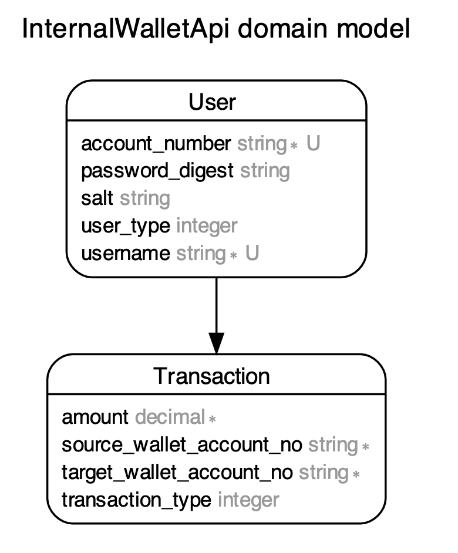

# Internal wallet transactional system (API)

A Rails-based application that manages a generic wallet solution for entities like User, Team, Stock, etc., ensuring transactional integrity and providing functionality for credit/debit operations.

## Features

* __Entity Specific Wallets:__ Each entity, be it a User, Team, or Stock has its own wallet for money management.
* __Transaction Based:__ All credit and debit operations are based on transaction records, ensuring traceability.
* __Validation & Integrity:__ Each transaction goes through validation ensuring data integrity and adherence to business rules.
* __Balance Calculation:__ The balance for each entity is dynamically calculated based on the sum of transactions.
* __Custom Sign-in:__ The system has its own sign-in mechanism, independent of external gems.
* __LatestStockPrice Integration:__ A custom library, adhering to gem standards, for retrieving latest stock prices.

## Requirements
* Ruby 2.7.6
* Rails 6.0.6.1
* PostgreSQL 15.1 (or change per your database)

## Setup
__1. Clone the repository__
```
git clone https://github.com/lea927/internal-wallet-api.git
```
__2. Install dependencies__
```
bundle install
```
__3. Setup the database__
```
rails db:create db:migrate db:seed
```
__4. Environmental Variables__  
Make sure to set up the required environmental variables for the system. Refer to example below for the necessary variables.
```
RAPID_API_KEY=my_secret_key
RAPID_API_HOST=rapid_api_host
SEED_USER_PASSWORD=my_valid_password
```
__5. Run the server__
```
rails s
```

## Database


## Usage
### Signing in
Upon starting the server, you'll be redirected to the login page to sign into the system. You can use any of the predefined usernames from `user1` to `user10`. The password for all these accounts is `P@ssw0rd`. For the corresponding `account_number` details of each user:
- `user1` has `account_number` '012345678901'
- `user2` has `account_number` '012345678902'
- ...
- `user12` has `account_number` '012345678912'


### Transactions
Upon logging in, the dashboard presents you with "Send Money" and "Withdraw Money" buttons, allowing you to initiate for each entity.
### Latest Stock Prices
Access latest stock prices using the integrated LatestStockPrice library. Anywhere in the Rails application, you can use the library like so: 
```ruby
client = LatestStockPrice::Client.new(ENV['RAPID_API_KEY'])

# Fetch price for a single ticker
price = client.price('NIFTY 50')

# Fetch prices for multiple tickers
prices = client.prices(['NIFTY', 'SMLCAP 50'])

# Fetch all prices
all_prices = client.price_all
```

## Development Tasks
__1. Architect Wallet Solution:__ A scalable architecture to handle credit/debit operations between various entities.  
__2. Model Relationships:__ Set up ActiveRecord associations and validations for precise wallet and transaction calculations.  
__3. STI for Money Manipulation:__ Use Single Table Inheritance or other appropriate design patterns for efficient money operations.  
__4. Custom Sign-in Mechanism:__ Build a sign-in system without reliance on external gems.  
__5. LatestStockPrice Library:__ A custom library present in the /lib directory that integrates with the [Latest Stock Price API](https://rapidapi.com/suneetk92/api/latest-stock-price).

---
## Disclaimer
This is just a basic template. You can expand upon it, adding sections like 'Testing', 'Deployment', 'Known Issues', 'Acknowledgments', etc.
